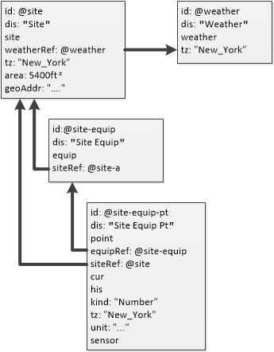

# 3 结构
## 3.1 概述
Haystack模型的主要结构是基于三个实体的层次结构：

+ Site: 拥有街道地址的单一建筑
+ Equip: Site 内的物理或逻辑设备
+ Point: 设备的传感器，执行器或设定值

此三级层次结构定义了跨项目使用的主要实体。 其他核心实体包括：

+ Weather: 外部天气条件

下图说明了这个基本的三级层次结构以及它们如何交叉引用：



## 3.2 容器(Containment)
Haystack本身不是基于“树结构”，但是可以使用[引用标签](TagModel#tagKinds)定义树结构。 由于给定的实体可以有多个引用标签，因此可以很容易地定义多维树结构。

核心 Site/Equip/Point 模型用作主干树结构和基本框架。然而，替代结构对于分析可能同样重要：

+ Electrical Distribution: 电表，子电表和电气负载如何相关？
+ Air Distribution: AHU，VAV和区域如何相关？
+ Chilled Water/Steam Distribution: AHU，中央设备，锅炉和制冷机如何相关？

由于领域的复杂性，您不应该假设任何一个树结构都可用于完全描述建筑物及其设备。最好把 Haystack project 看作一个数据图，其中实体使用引用标签定义了多种关系。

## 3.3 站点(Site)
站点实体使用 site 标签对单个设施进行建模。在对任何楼宇进行建模时，一个很好的经验法则是将其街道地址作为自己的站点。 例如，在对校园进行建模时，更好的方式是把每个建筑物作为一个站点，而不是把整个校园作为一个站点。

站点使用的核心标签:

+ geoAddr: 自由格式的站点地理地址（可能包括其他地理位置标签，如geoCity或geoCoord）
+ tz: 站点所在的时区
+ area: 设施的平方英尺或平方米。这使得站点通过面积进行规范。
+ weatherRef: 将该站点与气象站相关联，用以可视化天气状况并执行基于天气的能量归一化
+ primaryFunction: 描述建筑物主要功能的枚举字符串
+ yearBuilt: 建筑物四位数的建造年份

以下是一个使用地理位置标签充分展示一个站点实体的示例：
```
id: @whitehouse
dis: "White House"
site
area: 55000ft²
tz: "New_York"
weatherRef: @weather.washington
geoAddr: "1600 Pennsylvania Avenue NW, Washington, DC"
geoStreet: "1600 Pennsylvania Ave NW"
geoCity: "Washington D.C."
geoCountry: "US"
geoPostalCode: "20500"
geoCoord: C(38.898, -77.037)
```

## 3.4 设备
设备使用 equip 标签进行建模。设备通常是一个物理资产，如AHU，锅炉或冷水机。然而，equip标签也可以用于对诸如冷水机组之类的逻辑分组进行建模。

所有设备应使用 siteRef 标签在单个站点内进行关联。反过来，设备通常会包含使用 equipRef 标签与该设备相关联的点。

以下是一个AHU设备实体的示例：
```
id: @whitehouse.ahu3
dis: "White House AHU-3"
equip
siteRef: @whitehouse
ahu
```
equipRef 标签可以根据需要用于设备实体，以此来对嵌套设备和容器关系进行建模。

## 3.5 点
点通常是数字或模拟传感器或执行器实体（有时称为硬点）。点也可以表示一个配置值，例如设定值或计划日志（有时称为软点）。点实体用 point 标签标记。

所有点进一步分类为传感器，指令或设定点，使用以下三个标签之一：

+ sensor: 输入, AI/BI, 传感器
+ cmd: 输出, AO/BO, 执行器, 指令
+ sp: 设定点, 内部控制变量, 时间表

所有的点必须使用 siteRef 标签和站点相关联，使用 equipRef 标签与特定的设备相关联。 如果某一点没有物理设备关系，则使用虚拟设备实体对逻辑分组进行建模。

按照惯例，使用多个标签对一个点的作用进行建模：

By convention multiple tags are used to model the role of a point:

+ where: discharge, return, exhaust, outside
+ what: air, water, steam
+ measurement: temp, humidity, flow, pressure

以下是AHU排气温度输入点的示例：
```
id: @whitehouse.ahu3.dat
dis: "White House AHU-3 DischargeAirTemp"
point
siteRef: @whitehouse
equipRef: @whitehouse.ahu3
discharge
air
temp
sensor
kind: "Number"
unit: "°F"
```

### 3.5.1 点的分类
点分为Bool，Number或Str三种类型，使用 kind 标签进行区分：

+ Bool: 以true或false来模拟数字量的点。Bool点也可以为文本定义一个枚举标签，用于true或false的状态
+ Number: 模拟诸如温度或压力等模拟量的点。这些点也应该包含 unit 用以指示该点的测量单位。
+ Str: 用“关闭，慢速，快速”等模式对枚举点进行建模。枚举点也应该定义一个 enum 标签。

### 3.5.2 点的最小值和最大值
以下标签可用来定义点的最小值和（或）最大值：

+ minVal: 点的最小值
+ maxVal: 点的最大值

当这些标签应用于传感器点时，它们会模拟传感器可以读取和报告的值的范围。超出这些范围的值可能表示传感器的故障状态。

当这些标签应用于 cmd 或 sp，在对点执行指令时，它们规范有效的用户输入范围。

### 3.5.3 点的当前值
术语“cur”表示点的当前实时值的同步。实时通常意味着每过几秒钟就会更新一次。如果一个点支持当前或现场的实时值，那么它应该用 cur 标签标记。

以下标签用于表示当前值和状态：

+ curVal: 点的当前值，可以是Number，Bool或Str
+ curStatus: ok, down, fault, disabled 或 unknown
+ curErr: 如果 curStatus 为出错状态，curErr 则表示错误信息。

### 3.5.4 点的写入
可写点是对输出或设定值进行建模并可被指令控制的点。可写点在BACnet 16级优先级数组上建模，作为有效的第17级，而非默认值。可写点可以由 pointWrite 操作发送指令，并使用 writable 标签进行标记。

以下级别有特殊的行为：

+ **Level 1:** 最高优先级，被保留用于紧急情况下的覆写
+ **Level 8:** 手动覆写，能够将定时器设置为自动恢复
+ **Default:** 隐含地作为第17级并放弃默认值

当许多不同的控制应用程序可能争夺给定点的控制权时，优先级数组提供了争用解决方案。诸如时间表这样的的低级应用程序通常控制级别为14,15或16。那么用户可以在级别8上覆写。但是可以使用更高级别（如2到7）来胜过用户覆写（例如一个需要更高级别需求响应的能源事务）。

要写入的实际值通过从第1级开始解析，并且逐级下调至默认值以找到第一个非空值。在所有级别都为空的情况下，总写入输出为空（这又可能是另一个系统的自动/空值）。无论何时将空值写入优先级，我们认为该级别已设置为自动或释放（这允许下一个最高级别对输出进行控制）。

以下标签用来对点的可写状态进行建模：

+ writeVal: 这是当前优先级数组的“获胜”值，或者如果没有该标签，则获胜值为null
+ writeLevel: 从1到17的数字表示获胜优先级数组
+ writeStatus: 服务器将最后一个值写入输出设备的能力的状态：ok，disabled，down，fault。
+ writeErr: 如果在 writeStatus 是错误的情况下，writeErr 表示错误消息

### 3.5.5 Point His
If a point is historized this means that we have a time-series sampling of the point's value over a time range. Historized points are sometimes called logged or trended points. Historized points should be tagged with the his tag.

Historized points can have their time-series data read/write over HTTP via the hisRead and hisWrite operations.

If a point implements the his tag, then it should also implement these tags:

+ tz: all historized points must define this tag with their timezone name (must match the point's site timezone)
+ hisInterpolate: optionally defined to indicate whether the point is logged by interval of change-of-value
+ hisTotalized: optionally defined to indicate a point is collected an ongoing accumulated value

The current status of historization is modeled with:

+ hisStatus: ok, down, fault, disabled, pending, syncing, unknown
+ hisErr: error message if hisStatus indicated error

## 3.6 Weather
Building operations and energy usage are heavily influenced by weather conditions. This makes modeling of weather data a critical feature of Project Haystack. Because weather stations and measurements are often shared across multiple buildings, weather is not modeled as part of a site. Rather the weather tag models a separate top-level entity which represents a weather station or logical grouping of weather observations.

All weather entities should define a tz tag. Optionally they can also define geolocation tags such as geoCountry, geoCity, and geoCoord.

### 3.6.1 Weather Points
Weather data follows the same conventions as points, but to indicate that they associated with a weather entity, and not a site entity, we use the special tag weatherPoint to indicate a weather related point.

The following weather points are defined by the standard library:

+ weatherCond: enumeration of conditions (clear, cloudy, raining)
+ air temp: dry bulb temperature in °C or °F
+ wetBulb temp: web bulb temperature in °C or °F
+ apparent temp: preceived "feels like" temperature in °C or °F
+ dew temp: temperature in °C or °F below which water condenses
+ humidity: percent relative humidity
+ barometric pressure: atmospheric pressure in millibar or inHg
+ sunrise: historized trend of sunrise/sunsets as true/false transitions
+ precipitation: amount of water fall in mm or inches
+ cloudage: percentage of sky obscurred by clouds
+ solar irradiance: amount of solar energy in W/m²
+ wind direction: measured in degrees
+ wind speed: flow velocity measured in km/h or mph
+ visibility: distance measured in km or miles

Weather points are associated with their weather entity using the weatherRef tag.

### 3.6.2 Weather Example
Here is an example of a weather station and its associated points:
```
id: @weather.washington
dis: "Weather in Washington, DC"
weather
geoCoord: C(38.895, -77.036)

id: @weather.washington.temp
dis: "Weather in Washing, DC - Temp"
weatherRef: @weather.washington
weatherPoint
point
temp
sensor
kind: "Number"
unit: "°F"

id: @weather.washington.humidity
dis: "Weather in Washing, DC - Humidity"
weatherRef: @weather.washington
weatherPoint
point
humidity
sensor
kind: "Number"
unit: "%RH"
```

### 3.6.3 Weather vs Outside Tags
We often model both local weather sensors and data from an official weather station. Local sensors are typically used for HVAC control sequences. But we might use official weather data for checking local sensor calibration or baseline energy normalization. In Haystack, weather station data is annotated with weatherPoint and site-local sensors with outside:

+ weatherPoint temp versus outside temp
+ weatherPoint humidity versus outside humidity


